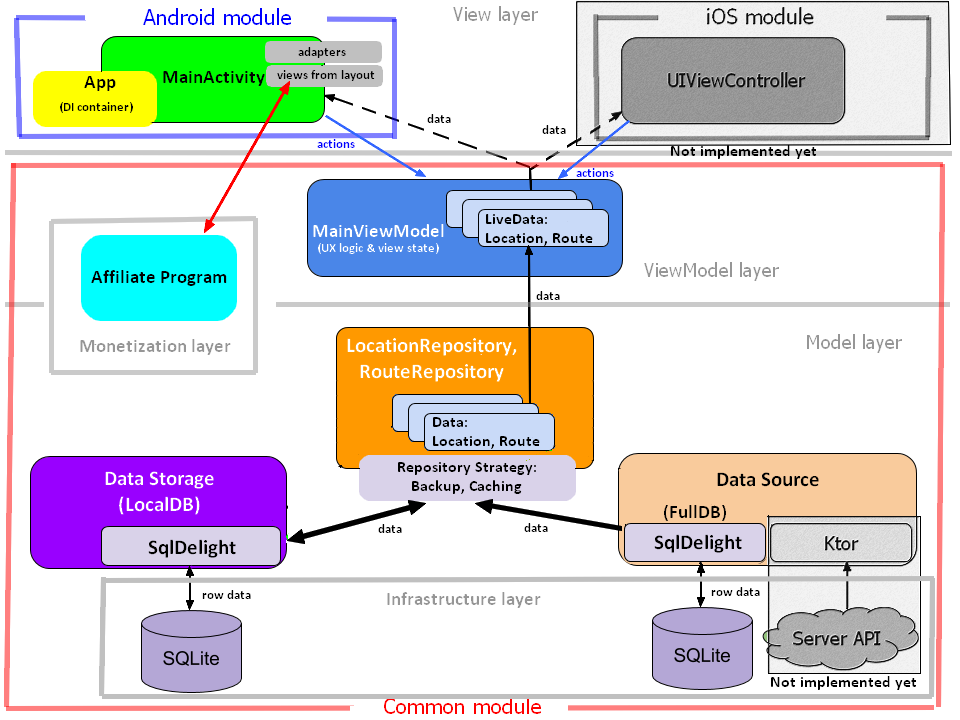

# CheapTripAndroid

This is mobile application to find the most profitable and unusual routes between cities with
airports by combining plane, train, bus, ferry and BlaBlaCar.

It's planned to use it as a mobile client for a shared server along with a web application, or as
a stand-alone unit.

It's supposed to be developed for two mobile platforms (Android and iOS). A cross-platform
implementation based on Kotlin Multiplatform Mobile is currently being developed. Common code and
UI version for Android are moving forward, UI version for IOS is pending later.

## Getting started

The project created on Kotlin v1.5.10 + KMM v0.2.5, and build on Gradle v6.7.1, appropriate plugins
must be installed previously. Other required dependencies are specified in build.gradle files and
are automatically installed.

Use Android Studio v4.2.1 to work with common code and Android application. Use Xcode one of the
latest (compatibility not tested) versions to work with iOS application. About setting Xcode and
working with a KMM project for iOS you may read:

https://www.infoq.com/articles/kotlin-multiplatform-ios-developers/

https://otus.ru/nest/post/1562/

> Application v1.0.0 (KMM version with copy of DB) requires a pre-populated database.
Due to exceeding the size of the DB file over the GitHub limit, it is hosted separately. 
>
> Before build download this file:
>
> https://drive.google.com/file/d/1czU8EphPWzQnDWH1Y6NNhTU4PXYB1cCY/view?usp=sharing
>
> and put it under the name **fullDb.sqlite3** into the directory **shared/src/commonMain/resources/MR/files/**
of the project.

## Project structure

* **shared** - Cross-platform codebase for the business logic.
    * commonMain - Shared code with expected classes/functions/properties.
    * commonTest - Unit tests
    * androidMain - Actual (platform-specific) classes/functions/properties for Android.
    * androidTest - Unit tests requiring Android SDK.
    * iosMain - Actual (platform-specific) classes/functions/properties for iOS.
    * iosTest - Unit tests requiring iOS SDK.
* **androidApp** - Platform-specific codebase for the UI version for Android, instrumental tests.
* **iosApp** - Platform-specific codebase for the UI version for iOS, instrumental tests.

> For more details see README.md into modules/packages directories.

## Architecture

The project is based on MVVM architecture. The shared (cross-platform) codebase covers the Model
(data classes and repositories) and ViewModel (UX logic and retained application state) levels.
Also, infrastructure and payload (monetization) are placed in the shared module too.
View level (UI) moved to platform-dependent modules.

> The payload concentrated in `AffiliateProgram` class that including available partners enumeration
> with the properties of their of applicability for concrete places. 
>
> Currently, it is planned to monetize based on redirects, therefore `AffiliateProgram` implements
> only choose suitable redirect URL. If necessary, the URL can be supplemented origin/destination
> locations, equipped UTM or changed to affiliate aggregator's URL.
>
> Implementation of the redirect to the selected affiliate URL is assigned to platform-dependent
> modules (VIEW_ACTION Intent for Android).

For the Android application, the View level is presented by `MainActivity` as the main UI controller
inflating views from xml-layouts. Also it binds UI action views to them handlers into ViewModel,
sets adapters for search results representation and subscribes on changing the state of the
ViewModel through the `LiveData` properties.

The `App` class as point of entry is responsible for dependencies injecting from the common code
into the android application, by providing the necessary implementations of platform-specific
components with application context.

Application resources (strings and images) related to the model and UI classes are allocated in the
shared module. For platform-specific modules they become available as native ones after (re-) building
the application.

> The [SqlDeLight cross-platform library](https://cashapp.github.io/sqldelight/multiplatform_sqlite/)
> (inside it's SQLite database on platform-specific driver) is used for access to the databases
> from shared code.
>
> SQL statements, needed for create DB structure and data operations, is concentrated in .sq files
> into **sqldelight...** directories.
>
> **IMPORTANT (1)!** Can't directly use the MySQL syntax (from server's DB backups) to update the
> structure and/or queries to the SQLite database, since their syntax is different.
>
> **IMPORTANT (2)!** Can't directly use the server's DB backup files for insert data to the SQLite
> database, since this files are too big for SqlDeLight generator. Ahead of time prepare a
> pre-populated database **fullDb.sqlite3** into the directory **shared/src/commonMain/resources/MR/files/**
> using one of the editors (such as SQLiteStudio) and row-by-row insert.

## Conventions

### Branching

* **main** - Once testing on **release** branch is done, **release** is merged into **main** to be
deployed in production.
* **release** - Once development of current version is done, **dev** is merged into **release** for
testing and final bugfixes.
* **dev** - Main development branch. All new features and all bugs for current version should be
done here.

### Versioning

* dev - **d**x.x.x
* release - **r**x.x.x
* main - x.x.x

## Developing

1. Create a new branch from **dev** or down, name it with the feature or issue you are dealing with.
2. Develop...
3. Merge remote upstream branch into your branch.
4. Push your branch to remote.
5. Create a pull request:
`https://github.com/talmantel/CheapTripAndroid/pull/new/**your_branch_name**` into upstream branch.

## Issues

When a new issue is found, create a new issue here:
https://github.com/talmantel/CheapTripAndroid/issues/new

Make sure to add appropriate labels including:
* **module: common**
* **module: android**
* **module: ios**
in accordance with the belonging of issue to the common/platform codebase.

Assign Denis (@denis-luttcev) or any developer if you know who is responsible for resolving the issue.

**Resolving issues:**

Link to issues fixed in a specific pull request or commit by typing "Resolves: #{issue number}" in
your pull request description or commit message. For example "Resolves: #123".

> For more details see
> https://docs.github.com/en/enterprise/2.16/user/github/managing-your-work-on-github/closing-issues-using-keywords

You can also see open issues assigned to you here:
https://github.com/talmantel/CheapTripAndroid/issues/assigned/@me and comment, close etc.

## When a new version is released

Use this link to see non-verified closed issues:

https://github.com/talmantel/CheapTripAndroid/issues?q=is%3Aissue+-label%3Averified+state%3Aclosed

To verify an issue was resolved, add the label 'verified' to it. If the issue was not resolved,
reopen the issue.